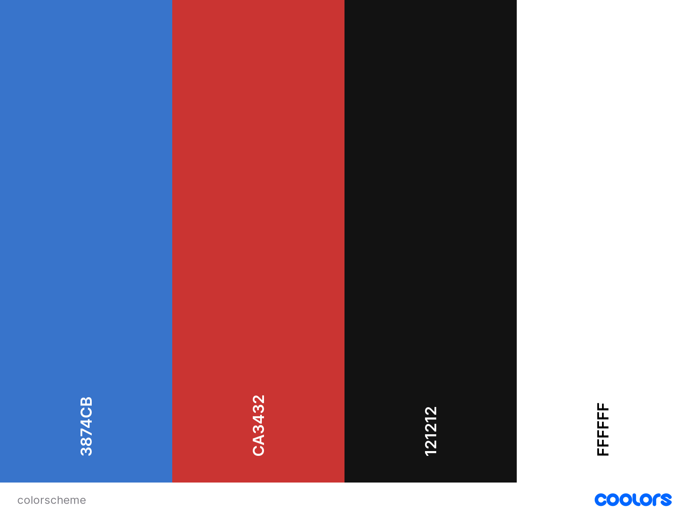
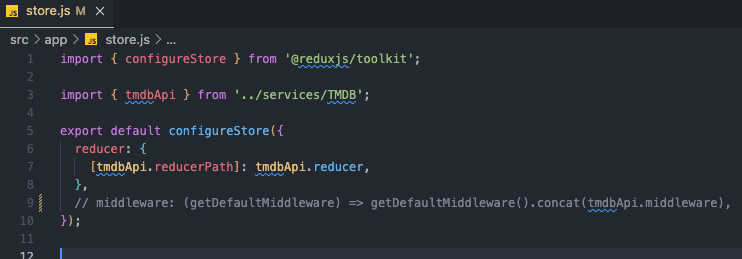
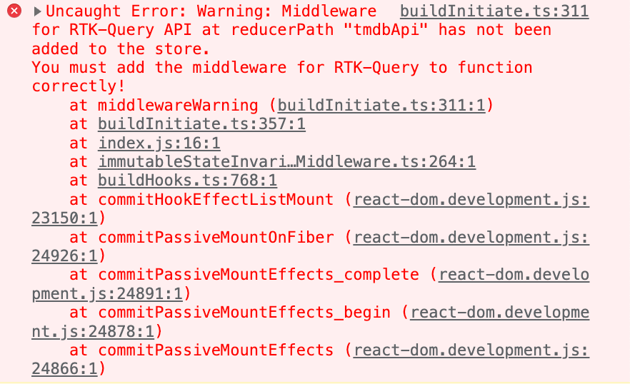

# This is an online database of information related to movies. I use The Movie Database API and design it with inspiration from Netflix. Built with React, designed with Material UI

## Table of Contents

- [User Experience (UX)](#user-experience-ux)
  - [Design](#design)
    - [Wireframes](#wireframes)
    - [Color Scheme](#color-scheme)
    - [Typography](#typography)
- [Features](#features)
  - [Home Page](#home-page)
  - [Navigation](#navigation)
- [Testing](#testing)
  - [Bugs](#bugs)
    - [Fixed Bugs](#fixed-bugs)
    - [Remaining Bugs](#remaining-bugs)
- [Technologies Used](#technologies-used)
  - [Languages and Frameworks Used](#languages-and-frameworks-used)
  - [Node Packages / Dependencies Used](#node-packages--dependencies-used)
  - [Programs and Tools Used](#programs-and-tools-used)
- [Deployment](#deployment)
  - [Forking the GitHub Repository](#forking-the-github-repository)
  - [Making a Local Clone](#making-a-local-clone)
  - [Deploying with Heroku](#deploying-with-heroku)
- [Credits](#credits)
  - [Acknowledgments](#acknowledgments)

[React](https://reactjs.org/)

## User Experience UX

### Design
### Wireframes
### Color-scheme

### Typography

## Features

### Home Page
### Navigation

## Testing

### Bugs
### Fixed Bugs

I got an error with the middleware in the APP. After reading more in the documentation, I saw that I had missed that I need to have middleware default in the API. Fixed according to the picture with comments showing what was missing

### Remaining Bugs

## Technologies Used

### Languages and Frameworks Used
### Node Packages / Dependencies Used
- Alan Ai - https://alan.app/docs/client-api/web/react/
- Material UI - https://mui.com/material-ui/getting-started/installation/
  - Mui icons
  - Mui material
  - Mui styles
  - Mui Theming - https://mui.com/material-ui/customization/theming/
- Reduxjs toolkit - https://redux-toolkit.js.org/
- axios - https://axios-http.com/docs/intro
- react redux - https://react-redux.js.org/
- react router dom - https://reactrouter.com/en/main
- Movie Database - https://www.themoviedb.org/
 - API - https://developers.themoviedb.org/3/getting-started/introduction

### Programs and Tools Used

## Deployment

### Forking the gitHub Repository
### Making a Local Clone
### Deploying with Hostinger

## Credits
### Acknowledgments

