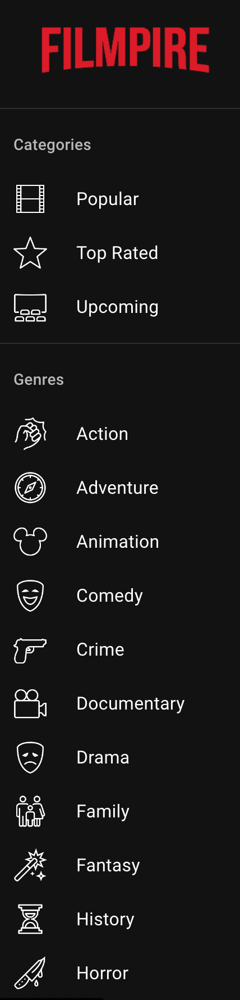
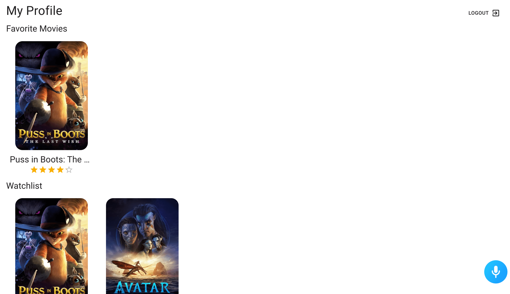

# An online database of movie information. The Movie Database API is used and old Netflix is used as an inspiration for the design.

## Built with React, designed with Material UI and smarter with Alan Ai.


## Table of Contents

- [User Experience (UX)](#user-experience-ux)
  - [Design](#design)
    - [Color Scheme](#color-scheme)
    - [Typography](#typography)
- [Features](#features)
  - [Home Page](#home-page)
  - [Navigation](#navigation)
  - [Sidebar](#sidebar)
  - [Profile](#profile)
  - [Movies](#movies)
  - [Actors](#actors)
  - [Ai Alan](#ai-alan)
- [Testing](#testing)
  - [Bugs](#bugs)
    - [Fixed Bugs](#fixed-bugs)
    - [Remaining Bugs](#remaining-bugs)
- [Technologies Used](#technologies-used)
  - [Languages and Frameworks Used](#languages-and-frameworks-used)
  - [Node Packages / Dependencies Used](#node-packages--dependencies-used)
  - [Programs and Tools Used](#programs-and-tools-used)
- [Deployment](#deployment)
  - [Forking the GitHub Repository](#forking-the-github-repository)
  - [Making a Local Clone](#making-a-local-clone)
  - [Deploying with Netlify](#deploying-with-heroku)
- [Credits](#credits)
  - [Acknowledgments](#acknowledgments)


## User Experience UX
```
Alan Ai command:
  "What does this app do?', 'What can I do here?', 'What is this app about?"

Alan Ai answer:
  "This is Filmpire, an app where you can find the movies you love.
  Try saying: 'Go to Comedy', 'Surprise me', 'Search for Superman', 'Make it dark', Log in"
```
```
Alan Ai command:
  "Make it dark"

Alan Ai answer:
  "Batman likes this, I hope you will as well."
```
```
Alan Ai command:
 "Make it light"

Alan Ai answer:
  "Ahh, my eyes hurt. Looks good though."
```
```
Alan Ai command:
  "Log in", "Login""

Alan Ai answer:
  "Logging you in."
```
```
Alan Ai command:
  "Log out", "Logout"

Alan Ai answer:
  "Logging you out."
```
```
Alan Ai command:
 "Go to (genre)"

Alan Ai answer:
  "Going to {genre}"
```
```
Alan Ai command:
  "Search for {genre}"

Alan Ai answer:
  "Searching for {genre}"
```
```
Alan Ai command:
  "It's Halloween.", "I want to get scared"

Alan Ai answer:
  "When Witches Go Riding and Black Cats Are Seen: The Moon Laughs and Whispers - It's Halloween"
```
```
Alan Ai command:
  "Give me something funny.", "I want to laugh"

Alan Ai answer:
  "Comedy it is. Enjoy!"
```
```
Alan Ai command:
  "Surprise me"

Alan Ai answer:
  Sounds good. Enjoy some {selectedCategory} movies.
```

### Color-scheme


### Typography

Roboto - https://fonts.googleapis.com/css?family=Roboto:300,400,500,700&display=swap

<hr>

## Features

Color mode - Light/Dark

### Home Page


### Navigation


### Sidebar




### Profile




### Movies


### Actors


### Ai Alan


<hr>

## Testing

### Bugs
### Fixed Bugs

I got an error with the middleware in the APP. After reading more in the documentation, I saw that I had missed that I need to have middleware default in the API. Fixed according to the picture with comments showing what was missing


### Remaining Bugs


<hr>

## Technologies Used

### Languages and Frameworks Used
React.js - https://reactjs.org/

JavaScript - https://www.javascript.com/

### Node Packages / Dependencies Used
- Alan Ai - https://alan.app/docs/client-api/web/react/
- Material UI - https://mui.com/material-ui/getting-started/installation/
  - Mui Icons - https://mui.com/material-ui/material-icons/
  - Mui Material
  - Mui Styles - https://mui.com/system/styles/basics/
  - Mui Theming - https://mui.com/material-ui/customization/theming/
- Redux.js Toolkit - https://redux-toolkit.js.org/
- axios - https://axios-http.com/docs/intro
- React Redux - https://react-redux.js.org/
- React Router Dom - https://reactrouter.com/en/main
- Movie Database - https://www.themoviedb.org/
  - API - https://developers.themoviedb.org/3/getting-started/introduction
- @emotion/react - https://www.npmjs.com/package/@emotion/react
- @emotion/styled - https://www.npmjs.com/package/@emotion/styled

### Programs and Tools Used

- [Canva](https://www.canva.com/)
- [Netlify](https://www.netlify.com/)
- [Git](https://git-scm.com/)
- [GitHub](https://github.com/)
- [Visual Studio Code](https://code.visualstudio.com/)
- [ESLint](https://eslint.org/)


<hr>

## Deployment

### Forking the GitHub Repository

By forking the GitHub Repository we make a copy of the original repository on
our GitHub account to view and/or make changes without affecting the original
repository by using the following steps...

1. Log in to GitHub and locate the [GitHub
   Repository](https://github.com/niclastanskanen/project-5-api)
1. At the top of the Repository (not top of page) just above the "Settings"
   Button on the menu, locate the "Fork" Button.
1. Click the button (not the number to the right) and you should now have a copy
   of the original repository in your GitHub account.

### Making a Local Clone

**NOTE**: It is a requirement of the project that you have Python version 3.8 or higher installed locally.

1. Log in to GitHub and locate the [GitHub Repository](https://github.com/niclastanskanen/react-film-app).
1. Under the repository name, click "Code".
1. To clone the repository using HTTPS, under "HTTPS", copy the link.
1. Open your local terminal with git installed
1. Change the current working directory to the location where you want the cloned directory to be created.
1. Type `git clone`, and then paste the URL you copied in Step 3.

    ```console
    ~$ git clone https://github.com/niclastanskanen/react-film-app
    ```

1. Press Enter. Your local clone will be created.

    ```console
    $ git clone https://github.com/niclastanskanen/react-film-app
    > Cloning into `test-dir`...
    > remote: Counting objects: 10, done.
    > remote: Compressing objects: 100% (8/8), done.
    > remove: Total 10 (delta 1), reused 10 (delta 1)
    > Unpacking objects: 100% (10/10), done.
    ```

    [Click here](https://help.github.com/en/github/creating-cloning-and-archiving-repositories/cloning-a-repository#cloning-a-repository-to-github-desktop) for a more detailed explanation of the process above with pictures.

1. Change the current working directory to the cloned project folder (this will be a child directory in the location you cloned the project).

1. This guide assumes you have Node.js and npm installed locally, if this is not the case please install these now.
1. From the terminal run the command `npm install` to install all project dependencies.
1. Run the command `npm start` to run the application.

### Deploying with Netlify

<hr>

## Credits
[TMDB Movie Database](https://www.themoviedb.org/)

### Acknowledgments

Adrian for good support and mentor.